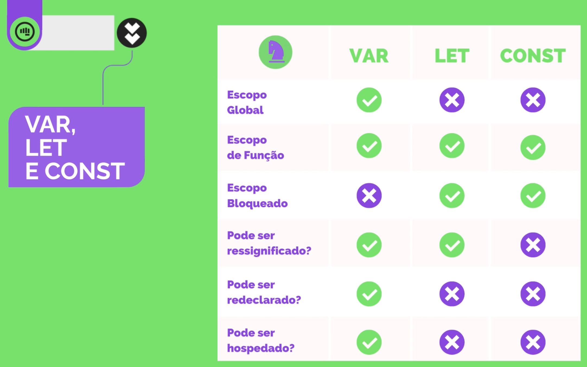

# HiringCodersTestes

## Módulo 01 - Introdução

Objetivo de um programador: desenvolver um software para <strong>outras pessoas</strong>. Ele deve <strong>entender a necessidade do usuário</strong> e transformar essa necessidade em uma aplicação.

> Software só é software se ajuda alguém.

Sobre o mercado: todo negócio precisará em algum ponto mudar para o digital.

Exemplos de áreas em que se pode atuar:

- Desenvolvedores;
- Analistas de infraestrutura;
- Analistas de Requisitos;
- Testadores;
- Profissionais UI/UX;
- DevOps;
- Telecomunicações.

É possível prestas serviços para qualquer país sem sair de casa.

O que um desenvolvedor faz?

- BackEnd
  - Dados
- FrontEnd
- Aplicativos

Ferramentas:

- GIT
- Metodologias Ágeis
- SoftSkills

Dev Junior:

- Deve saber um pouco de cada coisa como Back, Front, Git e metodologias ágeis. Com o tempo e avanço na carreira você será capaz de escolher sua área de especialização.

Linguagens de programação, forma de se comunicar com a máquina:

- Java;
- PHP;
- Python...

Bibliotecas: São pequenos trechos ou estruturas de código que podem ser reutilizados.

Frameworks: bibliotecas com manual de uso. Você precisa gastar tempo para aprender a utilizá-lo. O foco aqui é ganhar produtividade, segurança e rapidez.
Exemplos:

- FrontEnd
  - Angular;
  - React;

Editores de texto: local onde você irá escrever seus códigos.
Exemplos:

- Visual Studio Code

IDE: Ambiente Integrado de Desenvolvimento. Toda IDE também é um editor de texto. Junção de um editor de texto com ferramentas para auxiliar no desenvolvimento do código.
Exemplos:

- VSCode + Plugins
- Eclipse

## Módulo 02 - Lógica de programação

Algoritmo: Sequência finita de passos ordenados, cujo objetivo é a resolução de um problema através da transformação da informação (dados).

Ao passar uma informação para o computador é necessário ser o mais específico possível. Vale lembrar, que ele tem 0 conhecimento prévio.
[ ]
As intruções que são dadas para o computador podem ser separadas em blocos e executadas de forma repetiva sem precisar repití-las. Algumas condições também podem ser executadas mediante uma condição.

Todo programa ou partes de programa pode ser dividido em:

- Entrada;
  - Toda informação que precisa ser fornecido ao computador.
- Processamento;
  - Sequência de passos a ser cumprida para transformar a entrada na saída.
- Saída.
  - Aquilo que se espera obter ao final do programa.

Variáveis:

- Podem ser usadas para Qualificar e Quantificar informações:
  - Qualificação:
    - Inteiros
    - Reais
    - Cadeias
  - Quantificação:
    - Tamanho

Comparações:

- Elas são feitas com base em operadores relacionais(==, >, <, etc)

Operador AND e OR - Reavaliar a Tabela verdade

IF simples e composto - Reavaliar como usar.

Repetições:

- São a principal forma de fazer o computador executar a mesma instrução diversas vezes
- É preciso determinar quando o loop irá acabar
- Os comandos usados são FOR e WHILE
  - Em geral, usamos o WHILE quando não sabemos o número exato de repitições que serão executadas, porém sabemos a condição para término dessas execuções.
  - Para usar o FOR, temos que saber quantas repetições serão executadas

## Módulo 03 - GIT

GIT: Sistema de controle de versão distribuído = Desempenho, Segurança e Flexibilidade.

Principais ferramentas de GIT:

- GitHub - OpenSource
- BitBucket -
- GitLab - Mais customizável e privado

Principais comandos na linha de comando:

- 'git init' --> Cria um repositório na pasta que estiver selecionada na linha de comando;
- 'git add [nome do arquivo]' --> Adiciona o arquivo indicado a pasta do git. Exemplo: 'git add index.html'. Para adicionar mais de um arquivo é só separar o nome deles com espaço.
- 'git add .' --> Adiciona todos os arquivos que foram modificados desde a última adição a pasta do git;
- 'git commit -m "comentário"' --> Cria uma marca na linha do tempo do código para qual será possível retornar caso seja necessário. Essa marca será identificada pelo comentário inserido;
- 'git commit -am "comentário"' --> adiciona todas as alterações feitas desde o último 'git add' e ao mesmo tempo gera um commit com o comentário inserido
- 'git log' --> mostra os commits que foram feitos, quem fez e o comentário atrelado a cada um deles;
- 'git status' --> mostra todas as modificações que foram feitas mas não passaram por um commit e também indica a branch em que você está;
- 'git branch' --> gerencia as linhas de tempo alternativas;
- 'git checkout [nome da branch]' --> permite navegar entre as linhas de tempo alternativas, irá te levar para branch inserida no comando;
- 'git checkout [código identificador de um commit]' --> Permite voltar a um commit anterior, desfazendo todas as alterações que foram feitas posteriormente. Caso seja feita alguma modificação e essa modificação seja enviada, as modificações posteriores ao commit serão apagadas;
- 'git checkout -b [nome da branch]' --> Cria uma nova branch e migra pra ela automaticamente;
- 'git merge [nome da branch a ser adicionada]' --> une a linha do tempo informada com a que você está no momento;
- 'git push' --> envia as alterações para um repositório remoto(github);
- 'git clone [link do repositório]' --> pega um repositório que está guardado no seu repositório remoto e trás para o repositório local da sua máquina;
- 'git pull' --> sincroniza o repositório local com o repositório remoto.

OBS: Ao executar um merge, caso as branchs tenham mudanças em lugares distintos executadas em momentos diferentes, o git não saberá como juntar essas alterações e o desenvolvedor terá que resolver essa questão. Para ajudar, o git irá indicar quais são essas alterações, a quais branchs elas pertencem e quando foram realizadas. Para evitar problemas, <strong>sempre execute commits e merges curtos</strong>, dessa forma, será mais fácil resolver problemas com conflito.

Arquivo '.gitignore': Faz com que todos os arquivos que estão listados dentro dele sejam ignorados pelo git ao realizar adições ou commits.

FORK: Cópia do projeto original onde poderão ser feitas alterações sem afetar o original.

## CSS

Perguntas:
- Em CSS, qual propriedade é usada para adicionar espaço dentro do campo de texto ?
- Qual dos seguintes elementos é usado pela propriedade de filtro para desfocar as imagens?

**TAG `<style>`**

- É utilizada para inserir o código CSS e outras referências de estilização dentro do HTML;
- Ela deve ser inserida dentro da TAG `<head>`;
- Dentro dessa tag será escrito o código CSS que deve ser usado no projeto.
- Exemplo:
   ```
    <head>
      <style>
        div {
          border: solid 2px red;
        }
      </style>
    </head>

    <body>
      <div>Olá Mundo!</div>
    </body>
  ```
  - Para ficar mais organizado, não irei utilzar o CSS dessa forma nos projeto. Usaremos a tag link, para referenciar um arquvio CSS criado dentro da pasta do projeto.
  - Exemplo:
    `<link rel="stylesheet" href="style.css" />` ou 
    `<link rel="stylesheet" href="[nome do arquivo CSS].css" />`
  - Esse comando pode ser inserido com o Emmet digitando `link:css`


## Dados

Perguntas:
- Quando falamos em Tipos Abstratos de Dados, nos referimos a:
- Uma PILHA é uma estrutura de Dados que trabalha na forma:

### Estrutura de dados clássicas

Preocupação: Maneira como os dados são armazenados. São compostas por:
- Pilhas
- Listas
- Filas

Independente do que utilizamos, sempre vamos trabalhar com conjuntos, que podem ser classificados entre vetores ou arrays:
-  Representam uma variável ligada a uma séria de valores;
- Podemos fazer a associação com um armário com diversas caixas e para nos referirmos a uma caixa devemos especificar qual é o armário e qual o número da caixa;

Filas e pilhas costumam trabalhar com tamanhos limitados para facilitar a implementação, listas trabalham com conjuntos de tamanho infinito. Filas e pilhas são implementadas através de listas.

Tipos de dados abstratos:
- Pilha

**PILHAS**

Conceito está relacionado ao empilhamento de valores. Novos valores são adicionados na última posição. Caso seja necessário retirar valores eles serão retirados na ordem inversa que foram inseridos.

Para inserir novos elementos usamos o comando de PUSH e para retirar usamos o comando de POP.

Forma de declarar uma pilha em JS:
...
var elementos = [];
var topo =
...

**FILAS**

Tem o mesmo princípio de funcionamento das pilhas, porém aqui ao se adicionar um elemento, ele irá entrar no final e ao se retirar um elemento, iremos retirar do começo.

**LISTAS**

O critério de inserção e remoção de elementos funciona com base em decisões tomadas pelo usuário.

### Estruturas para classificação e recuperação de informação

Preocupação: Aquisição de dados de forma rápida. 

Para isso são usados algoritmos e busca e classificação:
- Busca sequencial;
- Busca binária;
- Algoritmo da bolha;
- Inserção;
- Seleção;

## JavaScript I

Podemos usar a ferramenta DevTools (F12) para fazer experimentações em sites já criados.

Aplicações que utilizam JavaScript
- Apps Mobile (React Native);
- Games;
- Robótica...

Comandos básicos:
- `console.log("Texto")`--> Irá printar no console do site o Texto inserido ou valor da variável inserida.
- `[nome do array].length` --> equivalente a quantidade de elementos de um array

### Declaração de variáveis

Estrutura:
1. `var nomeVariável = [valor];`
  - Declarações de escopo global ou de funções;
  - Deixam o código mais vulnerável;
2. `let nomeVariável = [valor];`
  - Escopo Bloqueado;
3. `const nomeVariável = [valor]`
  - Escopo bloqueado;
  - Não podem ser atualizadas e nem reatribuidas;
  - Precisa ser inicializada durante a declaração (precisa ser atribuído um valor a ela ao se criar a variável);

Diferença entre as estruturas:
<br>

<br>


Recomendações:
- Usar o ; no final de uma linha, apesar de não ser obrigatório;
- declarar o nome da variável com inicio em letra minúscula e segunda palavra com letra maiúscula;
- Escolher um nome que faça sentido para o uso da variável

O que não fazer:
- Usar número do começo do nome da variável;
- Usar espaço ou acentos no nome da variável;
- Usar alguma palavra reservada do JavaScript.

### Tipos de dados

No JS os dados são dinamicamente tipados, seu tipo pode mudar conforme a necessidade.

Tipos de dados:
- String
- Number
- Float
- Primitivos (null(vazio), undefined);
- Boolean (true/false)
- Objeto (variável com mais de um valor atribuído)
- Array
- Function (similar a um objeto, porém com o poder de ser executada ao ser chamada)

Temos alguns exemplos em Aula JavaScript/JavaScript.js.

Operador `typeof`: Dá como resultado o tipo de uma variável.

Exemplo: 
```
var age = 32
console.log(typeof age)
```

### Operadores

Tipos de operadores:
- **Aritiméticos**: +, -, *, /, %(resto), ++(incremento), --(decremento)
- **Atribuição**: =, +=, -=, *=, /=
  - x+=y <---> x=x+y
- **Comparação**: == (compara valor), === (compara valor e tipo), != (diferente de), <, <=, >, >=
- **Lógicos**: e(&&), ou(//), !(negação)

### Condicionais

Tipos de operadores condicionais:
- If/Else if/ Else (podem ser usados quantos else if você desejar)
- Switch/Case/Default (usado no lugar de vários else if)
  - Nesse caso, precisamos utilizar o comando break para parar o bloco de código caso ele seja atendido. Caso isso não seja feito, ele irá executar o comando no case e no default.
  - Aqui a comparação é do tipo ===, ou seja, se compara o tipo e o valor.
  - Default define o que vai ser executa caso nenhum dos Cases seja atendido.

Exemplos de código no arquivo referente a essa aula.

### Repetição

Normalmente é usado junto com arrays.

Tipos de comandos para repetição:
- FOR
  - Recebe 3 parâmetros: variável a ser interada e seu valor inicial, condição de término da repetição e a forma como a variável será incrementada;
  - Dentro do FOR deve ser inserido o comando a ser repetido;
  - Exemplo no código
- WHILE
  - Recebe como parâmetro apenas a condição de encerramento da repetição
  - O valor inicial da variável a ser interada geralmente é definido fora do WHILE e o incremento é definido dentro do WHILE e ao final do comando
- DO/WHILE
  -Similar ao While, porém a condição só será verificada ao final da execução do código
  - Nesse caso o DO não recebe parâmetro, apenas o WHILE.

  


## Soft Skills

### Inteligência Emocional

Pilares da inteligência emocional:

- Autoconsciência;
- Autogestão;
- Empatia;
- Habilidades sociais,

Fica a pergunta: Quais são os pontos que afetam a sua inteligência emocional hoje?

### Aprender a Aprender

Metáfora:

> O dorso e a pata de um cavalo, enquanto a cabeça e o dorso são a mente e a alma humana

Aprender é diferente de receber conteúdo. Aprendizado é a explicitação do conhecimento através de uma performance melhorada.

O aprendizado é fruto da experimentação.

Quanto mais gente tiver contato com a tecnologia melhor o mundo. Caso contrário o mundo será feito apenas para as pessaos que sabem desfrutar dele.

Livro sobre o assunto:

- Doutorado Informal - Alex Bretas
- Como aprendemos
- Vai Lá e Faz - Tiago Mattos
<br>

<br>
Passos para começar a aprender:

1. Decida aprender
2. Descubra suas formas;
3. Suspenda certezas;
4. Ouse saber por si;
5. Seja mais humilde

### Vocação

> Pergunte a si mesmo onde aprendeu a associar "errado" ou "anormal" a fazer coisas diversas

Pessoas como você existem e ainda sendo dessa forma elas tem sucessona vida.

> E se você não funcionar desse jeito?

Não há espaço para você nessa cultura mas isso não significa que você está errado.

Multipotentialite Super Powers

1. Síntese de ideias;
2. Rapid Learning;
3. Adaptabilidade.

Essas 3 habilidades podem ser perdidas se você for forçado a focar em apenas uma coisa.

### Processo de aprendizagem

> Se o seu ritmo de aprendizagem for igual ou inferior ao ritmo de mudança do mundo, você está involuindo.

Estratégia para acompanhar o mundo:

1. Eleger curadores, fontes que classifiquem a informação para você
2. Desenvolver habilidades para o cinto do batman
3. Se tornar um aprendedor autodidata.
